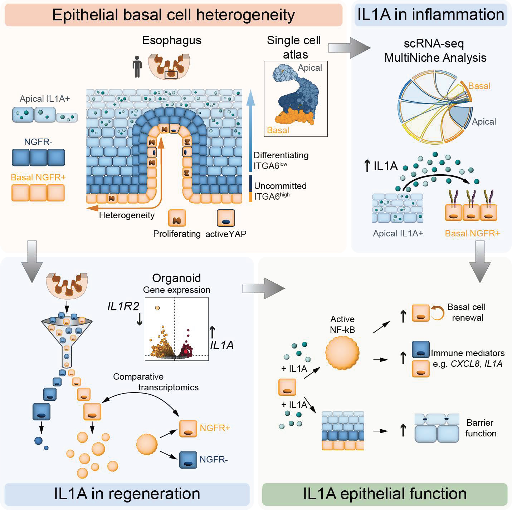

# Intraepithelial IL1A signaling promotes human esophageal inflammation while safeguarding epithelial basal cell identity and barrier function

This repository contains the R code used for the single-cell RNA-seq and bulk RNA-seq processing, analysis, and visualization presented in the manuscript:

**Intraepithelial IL1A signaling promotes human esophageal inflammation while safeguarding epithelial basal cell identity and barrier function**

<table align="center">
  <tr>
    <td>
      
    </td>
  </tr>
</table>

## Repository contents

```text
.
├── 00_scRNA_processing.R
├── 01_EoE_scRNA_processing.R
├── 02_Figure1.R
├── 03_FigureS1.R
├── 04_Figure2.R
├── 05_Figure3.R
├── 06_Figure4.R
├── 07_FigureS4.R
├── 08_BulkRNA_01_Preprocessing.R
├── 09_BulkRNA_02_PCA_QC.R
├── 10_BulkRNA_03_Paired_DESeq2.R
├── 11_BulkRNA_04_Heatmap_Volcano.R
├── 12_BulkRNA_05_GSEA_GO.R
├── 13_BulkRNA_06_Targeted_Analysis.R
├── EoE_source.R
├── multinichenetr.R
├── sessionInfo.txt
└── README.md
```

## Overview

The repository contains code for two major analysis components:

1. **Human esophageal single-cell RNA-seq analysis**
2. **Bulk RNA-seq analysis of NGFR-positive and NGFR-negative epithelial populations**

It also contains figure-specific scripts and helper functions used for visualization and cell-cell communication analysis.

---

# Single-cell RNA-seq analysis

## `00_scRNA_processing.R`

Original single-cell RNA-seq processing script retained as part of the analysis record.

The organized processing workflow used for the downstream analyses in this repository is provided in:

```text
01_EoE_scRNA_processing.R
```

## `01_EoE_scRNA_processing.R`

Main single-cell RNA-seq processing workflow.

Major steps include:

- loading the human esophageal single-cell RNA-seq dataset;
- addition and organization of clinical and reference metadata;
- quality-control filtering;
- downsampling;
- cell-type regrouping;
- doublet detection and removal using DoubletFinder;
- normalization and variable-feature selection;
- principal component analysis;
- Harmony integration using donor identity;
- graph-based clustering;
- UMAP and t-SNE dimensionality reduction;
- cell-cycle scoring;
- final cell-type annotation;
- generation of epithelial-only Seurat objects for downstream analyses.

The final clustering workflow uses:

```text
Harmony dimensions: 1-25
Clustering resolution: 0.7
UMAP n.neighbors: 30
UMAP min.dist: 0.3
```

---

# Figure-specific single-cell analysis

## `02_Figure1.R`

Code used for computational panels associated with **Figure 1**.

Includes:

- epithelial UMAP;
- epithelial differentiation-marker heatmap.

Microscopy-based panels are not generated by this R script.

## `03_FigureS1.R`

Code used for computational panels associated with **Figure S1**.

Includes:

- UMAP of the major cell populations;
- Nebulosa density plots of lineage markers;
- immune-cell marker dot plot;
- epithelial marker expression;
- cell-cycle UMAP;
- epithelial cell-cycle phase distribution;
- epithelial gene-density overlap analysis.

## `04_Figure2.R`

Code used for the computational panel in **Figure 2** in which bulk RNA-seq-derived NGFR-positive and NGFR-negative transcriptional signatures are projected onto the epithelial single-cell UMAP.

The signatures are derived from the **top 50 differentially expressed genes** identified in the tissue NGFR-positive versus NGFR-negative bulk RNA-seq comparison.

Module scores are calculated using Seurat's `AddModuleScore`.

## `05_Figure3.R`

Code used for the computational panel in **Figure 3** in which organoid-derived NGFR-positive and NGFR-negative transcriptional signatures are projected onto the epithelial single-cell UMAP.

The signatures are derived from the **top 50 differentially expressed genes** identified in the P1 control organoid NGFR-positive versus NGFR-negative bulk RNA-seq comparison.

## `06_Figure4.R`

Code used for computational panels associated with **Figure 4**.

Includes:

- epithelial UMAP;
- MultiNicheNet/NicheNet cell-cell communication analysis;
- chord diagrams of ligand-receptor interactions directed toward basal cells;
- visualization of the strongest basal-directed interactions;
- IL1A expression analysis.

For the cell-cell communication analysis, the final visualization focuses on the **top 20 ligand-receptor interactions directed toward basal cells**.

Microscopy-based panels are not generated by this R script.

## `07_FigureS4.R`

Code used for computational panels associated with **Figure S4**.

Includes:

- healthy versus EoE epithelial UMAPs;
- epithelial subpopulation distributions;
- cell-cycle phase distributions;
- UMAP visualization of IL13, IL33, IL36B, IL1A, and IL1B;
- donor-level IL1A expression in apical cells;
- IL1-family receptor expression across epithelial cell states.

---

# Bulk RNA-seq analysis

The bulk RNA-seq scripts are organized according to the order of the analysis workflow.

## `08_BulkRNA_01_Preprocessing.R`

Bulk RNA-seq count-matrix preparation.

Major steps include:

- loading the raw count matrix;
- filtering low-expression genes;
- reorganizing donor/sample identifiers;
- applying sample exclusions used in the original analysis;
- generating count matrices for pairwise comparisons.

The final filtering criterion retains genes with:

```text
Total counts > 100 across all samples
AND
Non-zero expression in at least 50% of samples
```

The following pairwise comparisons are prepared:

1. P0 NGFR-positive versus NGFR-negative;
2. P1 control NGFR-positive versus NGFR-negative;
3. control NGFR-positive P1 versus P0;
4. control NGFR-negative P1 versus P0;
5. P1 IL1A versus control, with NGFR-positive and NGFR-negative populations combined;
6. P1 NGFR-positive IL1A versus control;
7. P1 NGFR-negative IL1A versus control.

## `09_BulkRNA_02_PCA_QC.R`

Bulk RNA-seq PCA and library-size quality control.

For PCA, counts are transformed using:

```r
log2(counts + 1)
```

Genes with zero variance are removed before PCA.

PCA is performed using:

```r
prcomp(t(log_counts), scale. = TRUE)
```

The script also contains a function for comparing raw and DESeq2-normalized library sizes.

## `10_BulkRNA_03_Paired_DESeq2.R`

Paired differential-expression analysis using DESeq2.

Because samples from the same donor are compared across experimental conditions, donor identity is included as a blocking factor:

```r
design = ~ patient + condition
```

For each comparison, the script exports:

- complete DESeq2 results;
- normalized counts;
- rlog-transformed counts.

The principal differential-expression threshold used for downstream visualization is:

```text
|log2 fold change| > 0.585
adjusted P value < 0.05
```

## `11_BulkRNA_04_Heatmap_Volcano.R`

Generates bulk RNA-seq:

- marker-expression heatmaps;
- volcano plots.

Heatmaps use row-wise z-score normalization and a blue-white-red color scale.

## `12_BulkRNA_05_GSEA_GO.R`

Gene-set enrichment analysis.

The analysis uses:

```text
v2024.1.Hs.symbols.gmt
```

The script includes:

- ranked GSEA;
- visualization of selected enriched pathways;
- over-representation analysis.

## `13_BulkRNA_06_Targeted_Analysis.R`

Targeted bulk RNA-seq analyses.

Includes:

- IL1-family expression heatmaps;
- extraction of bulk-derived NGFR-positive and NGFR-negative transcriptional signatures;
- extraction of the top 50 genes used for the single-cell signature projections in Figures 2 and 3.

The single-cell projection of these signatures is performed in:

```text
04_Figure2.R
05_Figure3.R
```

---

# Helper scripts

## `EoE_source.R`

Collection of project-specific plotting and helper functions used by multiple figure scripts.

Functions include utilities for:

- UMAP visualization;
- gene-expression plotting;
- Nebulosa density visualization;
- violin plots;
- density overlap visualization;
- figure formatting and layout.

Several figure scripts source this file during execution.

## `multinichenetr.R`

MultiNicheNet/NicheNet analysis workflow used for cell-cell communication analysis in Figure 4.

This script generates the MultiNicheNet analysis objects used to prioritize ligand-receptor interactions between cell populations.

The Figure 4 analysis uses these results to visualize ligand-receptor interactions directed toward basal epithelial cells.

---

# Data availability

The human eosinophilic esophagitis single-cell RNA-seq atlas used in this study was obtained from the **Broad Institute Single Cell Portal**:

```text
SCP1242
```

Bulk RNA Prime-sequencing data generated in this study are available through the **Gene Expression Omnibus (GEO)**:

```text
GSE314119
```

Large raw and intermediate data files are not stored directly in this GitHub repository.

---

# Analysis workflow

## Single-cell RNA-seq

```text
01_EoE_scRNA_processing.R
        ↓
Processed single-cell and epithelial-only Seurat objects
        ↓
02_Figure1.R
03_FigureS1.R
04_Figure2.R
05_Figure3.R
06_Figure4.R
07_FigureS4.R
```

`EoE_source.R` provides helper functions used by several figure scripts.

The MultiNicheNet-dependent analyses in `06_Figure4.R` use results generated by:

```text
multinichenetr.R
```

## Bulk RNA-seq

```text
08_BulkRNA_01_Preprocessing.R
        ↓
09_BulkRNA_02_PCA_QC.R
        ↓
10_BulkRNA_03_Paired_DESeq2.R
        ↓
11_BulkRNA_04_Heatmap_Volcano.R
        ↓
12_BulkRNA_05_GSEA_GO.R
        ↓
13_BulkRNA_06_Targeted_Analysis.R
```

---

# Software environment

Analyses were performed using:

```text
R version 4.3.1 (2023-06-16 ucrt)
Platform: x86_64-w64-mingw32/x64 (64-bit)
Operating system: Windows 11 x64
```

Major packages used in the analyses include:

| Package | Version |
|---|---:|
| Seurat | 4.4.0 |
| SeuratObject | 5.0.2 |
| DoubletFinder | 2.0.4 |
| harmony | 1.2.0 |
| Nebulosa | 1.12.1 |
| UCell | 2.6.2 |
| DESeq2 | 1.40.2 |
| nichenetr | 2.0.6 |
| ComplexHeatmap | 2.18.0 |
| clusterProfiler | 4.10.1 |
| ggplot2 | 3.5.1 |
| dplyr | 1.1.3 |
| patchwork | 1.2.0.9000 |
| circlize | 0.4.16 |
| SingleCellExperiment | 1.24.0 |
| monocle3 | 1.3.4 |

The complete R session information, including attached packages and namespace-loaded dependencies, is provided in:

```text
sessionInfo.txt
```

---

# Reproducibility notes

- The scripts retain the main parameters used for the analyses reported in the manuscript.
- Some scripts contain absolute Windows file paths from the original analysis environment. These paths must be adjusted to match the local directory structure when reproducing the analysis on another system.
- Several figure scripts depend on processed `.RDS` or `.qs` objects generated by upstream analyses.
- Large Seurat objects, raw count matrices, and intermediate analysis files are not included in this GitHub repository.
- Image-based immunofluorescence and microscopy panels are outside the scope of this code repository.
- Paired bulk RNA-seq comparisons use donor identity in the DESeq2 design.
- Bulk-derived NGFR-positive and NGFR-negative signatures projected onto single-cell UMAPs contain the top 50 differentially expressed genes from the corresponding bulk RNA-seq comparisons.

---

# Citation

If you use this code, please cite the associated manuscript:

> Eenjes E, Troost ML, Lei L, Köck A, Grommisch D, Mondria MT, Truskaite K, Klevebro F, Nilsson M, Genander M.  
> **Intraepithelial IL1A signaling promotes human esophageal inflammation while safeguarding epithelial basal cell identity and barrier function.**

Journal and DOI information will be added upon publication.

---

# Contact

For questions regarding the study or repository, please contact the corresponding author listed in the manuscript.

---

# License

No license has currently been specified for this repository.
